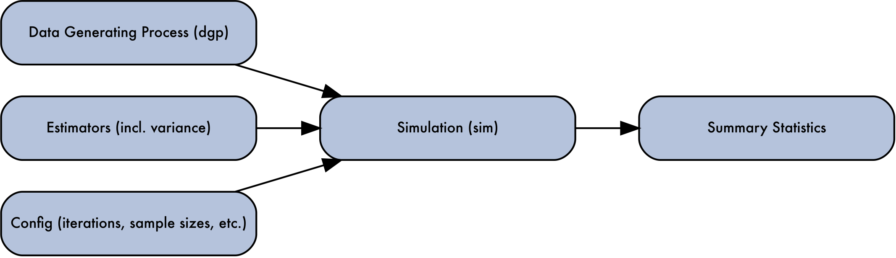

# `{Simulacron3}` 

The purpose of the `{Simulacron3}` package is to provide easy-to-use boilerplate
functionality for simple simulation studies. The most common, archetypal example
of a usecase would be comparing the performance of multiple estimators as the
sample size of training data increases.

A fundamental thesis of this package is that many simulation studies (of the
statistical performance of estimators) follow the following workflow:



## Demonstration

```{r}
library(Simulacron3)
# Example Usage
# Define a data generating process
dgp <- function(n) data.frame(x = rnorm(n), y = rnorm(n))

# Define some estimators
estimators <- list(
  mean_estimator = function(data) mean(data$x),
  var_estimator = function(data) var(data$x)
)

# Define a summary statistics function 
# 
# An estimator can potentially return a lot more data than can be stored
# in one row of results, so the summary_stats functions are used to 
# condense that information down.  Here they're not doing very much, but
# in more advanced simulations we will see why they're crucial. 
summary_func <- function(iter = NULL, est_results, data = NULL) {
  data.frame(
    mean_est = est_results$mean_estimator,
    var_est = est_results$var_estimator
  )
}

# Create a simulation object
sim <- Simulation$new()

# Set up the simulation
sim$set_dgp(dgp)
sim$set_estimators(estimators)
sim$set_config(list(replications = 500, sample_size = 50))
sim$set_summary_stats(summary_func)

# Run the simulation
sim$run()

# Retrieve results
results <- sim$get_results()
head(results)
```

## Package Internals 

`{Simulacron3}` is meant to have easy to understand source code (and
not too much of it) so that users can easily reason about what to expect
from their simulations. Check out the source, especially for the `$run()` method
here: 

  - <https://github.com/ctesta01/Simulacron3/blob/main/R/Simulation.R>

### Package Title Inspiration

To quote Wikipedia: 


> Simulacron-3 (1964), by Daniel F. Galouye, is an American science fiction novel featuring an early literary description of a simulated reality. <br><br>
> ... As time and events unwind, [Fuller] progressively grasps that his own world is
probably not "real" and might be only a computer-generated simulation.

<br><br>

## Other Related Works

`{Simulacron3}` is one of many attempts to standardize the workflow of running
simulations. A lot of inspiration was taken from: 

  - [simChef](https://github.com/Yu-Group/simChef)
  - [SimEngine](https://avi-kenny.github.io/SimEngine/)
  - [simcausal](https://www.jstatsoft.org/article/view/v081i02)
  - [simulator](https://github.com/jacobbien/simulator)
