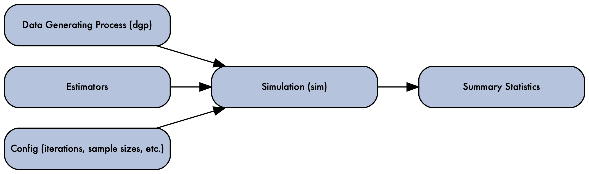

# `{Simulacron3}` 

The purpose of the `{Simulacron3}` package is to provide easy-to-use
boilerplate functionality for simple simulation studies. The most
archetypal example of a usecase is comparing the performance of multiple
estimators as the sample size of training data increases.

A fundamental thesis of this package is that many simulation studies (of
the statistical performance of estimators) follow the following
workflow:

<figure>

<figcaption aria-hidden="true">A flow diagram with simulation (sim) in
the middle, data generating process (dgp), estimators, and config
(iterations, sample sizes, etc) leading into it, and out of the
simulation coming summary statistics.</figcaption>
</figure>

## Demonstration

``` r
library(Simulacron3) 
# the only thing Simulacron3 contains is the Simulation R6 Class, used below

# Example Usage
# Define a data generating process
dgp <- function(n) data.frame(x = rnorm(n), y = rnorm(n))

# Define some estimators 
estimators <- list(
  mean_estimator = function(data) mean(data$x),
  var_estimator = function(data) var(data$x)
)

# Define a summary statistics function 
# 
# An estimator can potentially return a lot more data than can be stored
# in one row of results, so the summary_stats functions are used to 
# condense that information down.  Here they're not doing very much, but
# in more advanced simulations we will see why they're crucial. 
summary_func <- function(iter = NULL, est_results, data = NULL) {
  data.frame(
    mean_est = est_results$mean_estimator,
    var_est = est_results$var_estimator
  )
}

# Create a simulation object
sim <- Simulation$new()

# Set up the simulation
sim$set_dgp(dgp)
sim$set_estimators(estimators)
sim$set_config(list(replications = 5000, sample_size = 500))
sim$set_summary_stats(summary_func)

# Run the simulation
sim$run()

# Retrieve results
results <- sim$get_results()
head(results)
```

    ##       mean_est   var_est
    ## 1 -0.000358145 1.0029123
    ## 2  0.014233217 0.9832642
    ## 3 -0.053425707 0.9297267
    ## 4  0.004113618 1.0936967
    ## 5 -0.084775258 0.9653678
    ## 6  0.022799863 1.0084176

See
<https://ctesta01.github.io/Simulacron3/articles/Comparing-Estimators.html>
for a slightly more involved example.

## Parallelization

Parallelization is supported, and as simple as passing `parallel = TRUE`
to the `config` for your simulation and declaring a `plan(multisession)`
with the `{future}` package.

``` r
library(microbenchmark)

# let's benchmark the simulation we specified above 
microbenchmark::microbenchmark(sim$run(), times = 10)
```

    ## Warning in microbenchmark::microbenchmark(sim$run(), times = 10): less accurate
    ## nanosecond times to avoid potential integer overflows

    ## Unit: milliseconds
    ##       expr      min       lq     mean   median       uq      max neval
    ##  sim$run() 824.2277 838.2386 846.9038 844.4248 852.6623 886.7453    10

``` r
# just change the config to run in parallel
sim$set_config(list(parallel = TRUE)) 
future::plan(future::multisession) # setup an appropriate future::plan 
microbenchmark::microbenchmark(sim$run(), times = 10)
```

    ## Unit: milliseconds
    ##       expr      min       lq     mean   median       uq     max neval
    ##  sim$run() 589.8162 597.6803 676.0713 613.2764 619.8425 964.878    10

Underlying this is usage of the `{future.apply}` package. See
<https://future.futureverse.org/> for a description of the types of
plans that can be specified.

## Package Internals

`{Simulacron3}` is meant to have easy to understand source code (and not
too much of it) so that users can easily reason about what to expect
from their simulations. Check out the source, especially for the
`$run()` method here:

- <https://github.com/ctesta01/Simulacron3/blob/main/R/Simulation.R>

### Package Title Inspiration

To quote Wikipedia:


> Simulacron-3 (1964), by Daniel F. Galouye, is an American science
> fiction novel featuring an early literary description of a simulated
> reality. <br><br> … As time and events unwind, \[Fuller\]
> progressively grasps that his own world is probably not “real” and
> might be only a computer-generated simulation.

<br><br>

## Other Related Works

`{Simulacron3}` is one of many attempts to help with the workflow of
running simulations. A lot of inspiration was taken from:

- [simChef](https://github.com/Yu-Group/simChef)
- [SimEngine](https://avi-kenny.github.io/SimEngine/)
- [simcausal](https://www.jstatsoft.org/article/view/v081i02)
- [simulator](https://github.com/jacobbien/simulator)
